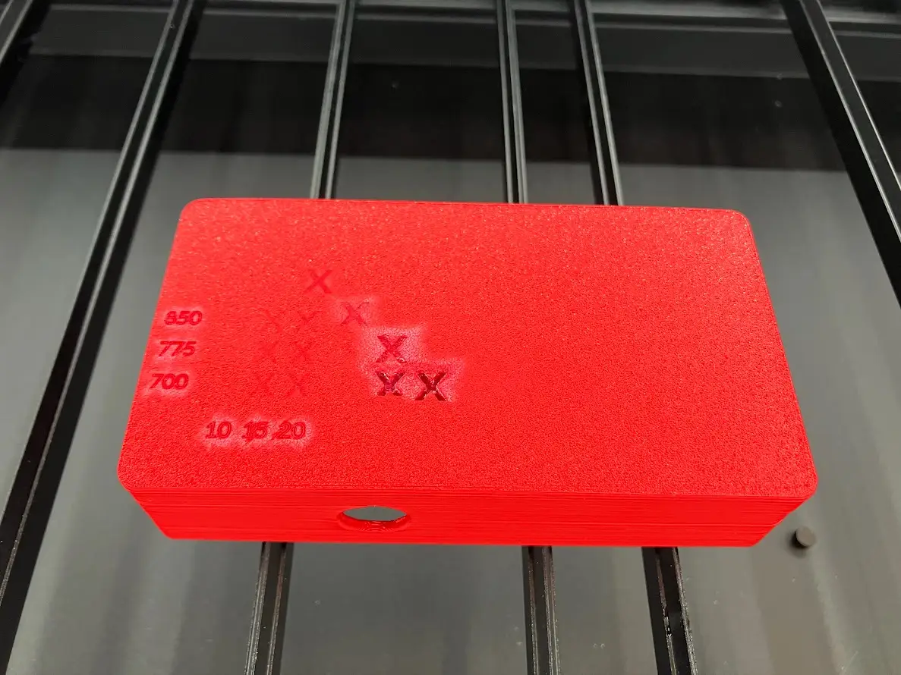
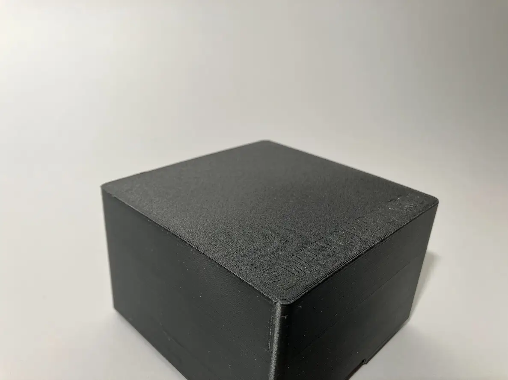

On the single-core ESP32 C3, I encountered the issue where within each loop, I can either send audio or play sound, but never both. When I do both, the microphone became silent.

If we alternating between the two tasks, it would work as expected.

```cpp
bool shouldSend = false;

if (shouldSend && isTransmitting) {
  micToUdpCopier.copy();
} else if (!shouldSend && !isTransmitting) {
  soundToSpeakerCopier.copy();
}

shouldSend = !shouldSend;
```

# Plans

1. Laser cut unit-1/2 or fabricate a vinly cut sticky
1. Reduce audio band width with either ADPCM or lower sample rate to 16kHz
1. Debug undrained buffer played after button up
1. Add one distinct voice per story
1. Produce unit-2

# DONE

1. Make sure speaker makes sound
2. Test computer streaming sound to speaker
3. Add microphone to stream via UDP

## Gemini hacks

- Function calling seems to cause double response
- Use Non-blocking functions with SILENT response removes doube response but function request is ignored
- Add a manual non-terminiating text message to model fixed the missing tool result

## Adding laser engraved graphic design

- Charactered CO2 laser on PLA plaster
- Power: 10%, 15%, 20%
- Speed: 700mm/s, 775/s, 850/s


**Characterization matrix**

- Ideal engraving setting: 700mm/s, 15% power, 50 lines/cm
- Also characterized scoring, best setting: 200mm/s, 40% power


**Operator Unit-01 Engraved**


**Operator Unit-02 Engraved and Scored**

- Learning
  - Found that over-powering causes white smoky residue
  - Alan mentioned that fiber laser would create a much better surface contrast on black plastic. I should try that in the future
  - Color is a key factor in engraving/scoring outcomes:
    - Red
      - Engraving: great
      - Scoring: great
    - White
      - Engraving: invisible
      - Scoring: great
    - Black
      - Engraving: ok
      - Scoring: ok

When I was engraving the switchboard, the rapid back and forth motion shifted the material. I attempted to overlay with multiple passes of engraving and scoring, only to make matters worse.


**After multiple passes, the Switchboard looks terrible**

- For letter scoring, straight lines are much more pronounced than curves
  - I, T, W look great
  - S, C, O does not have enough contrast
- Two hypothesis that we can test in the future
  - The curved lines prevents laser to build up heat
  - The FDM process creates directional surfaces.

# Core Game Loop

## Character customization

- AI generates 7 distinct characters, based on story telling archetypes
- Single or two players plug into the switchboard to connect to a character
- When all the buttons on all the operators are pressed, story begins

## Exploration phase

- Each player can investigate pulsing lights on the switchboard to gather information
- When they are ready, one of them commit to take action
- Light blinks under all players, indicating action

## Action phase

- AI provides action options
- One of the players take action
- AI will force transition to Exploration phase after action is taken
